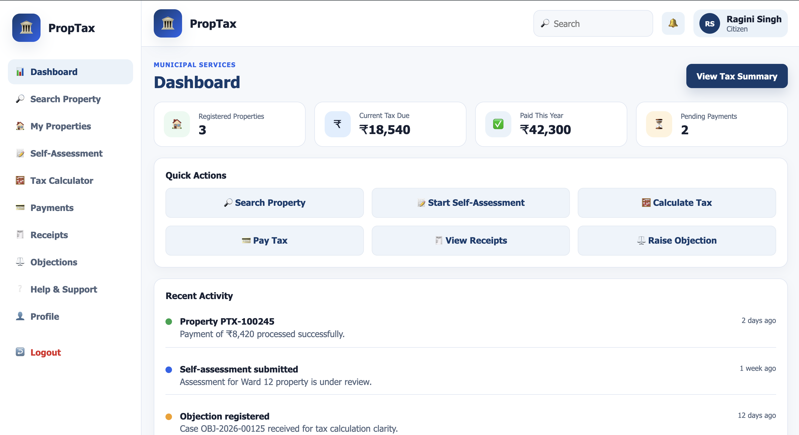
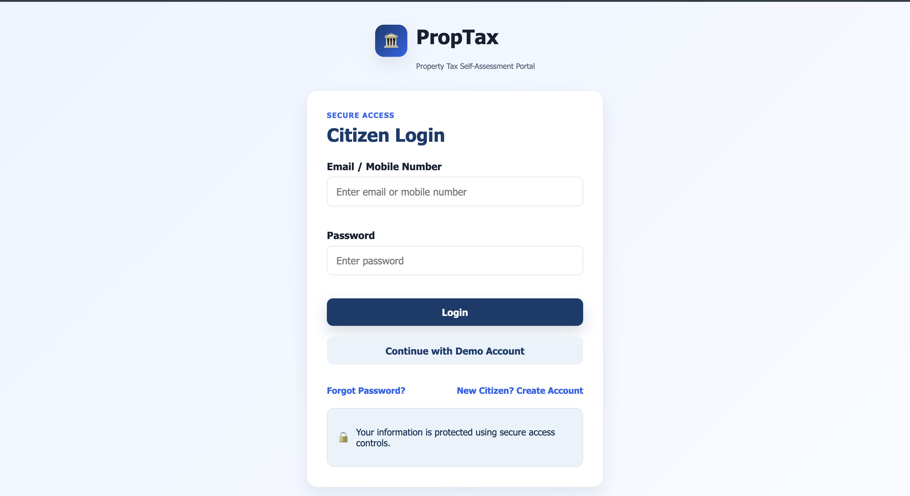
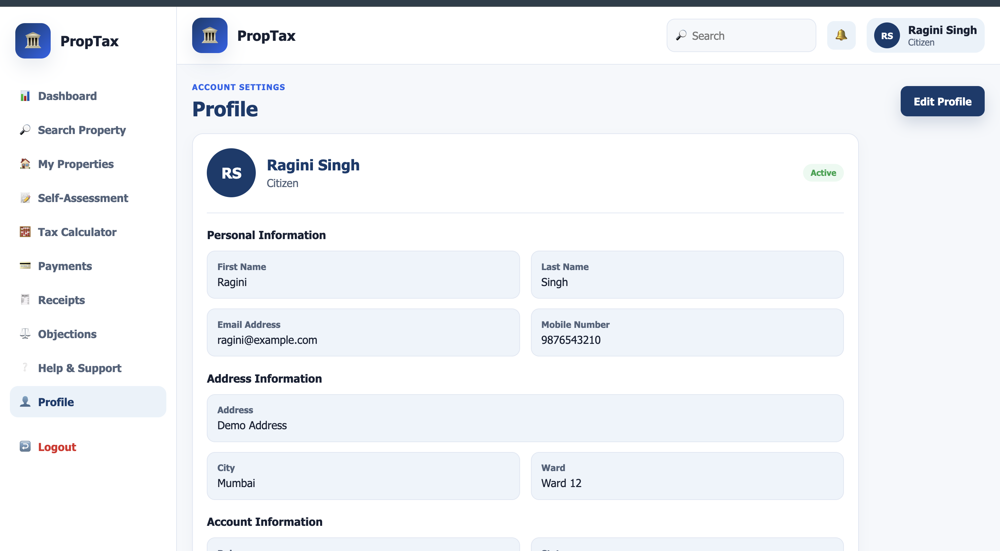
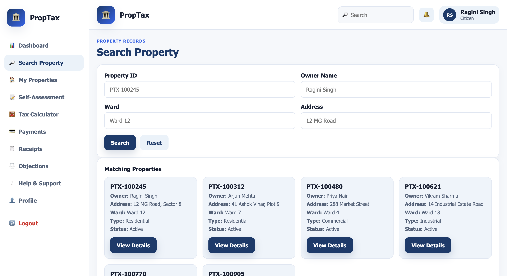
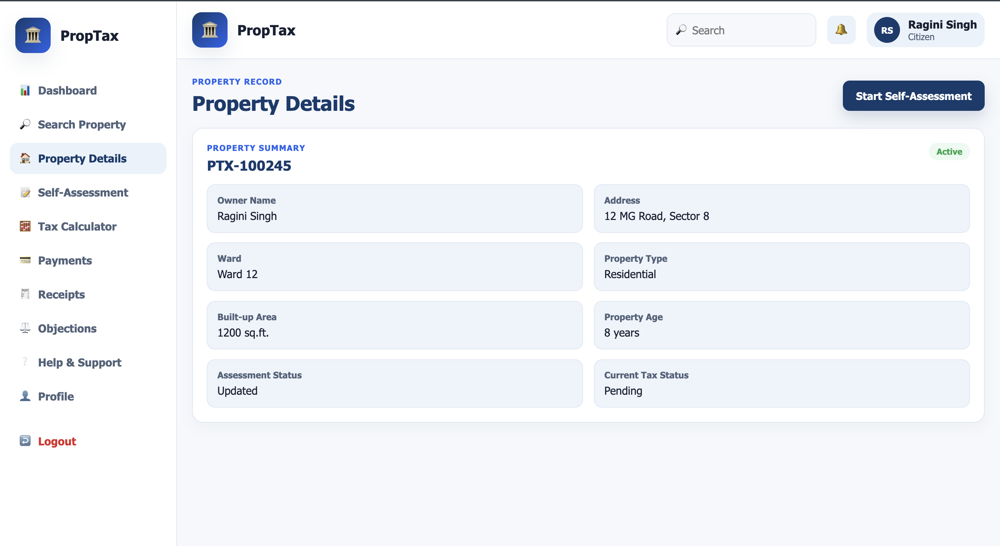
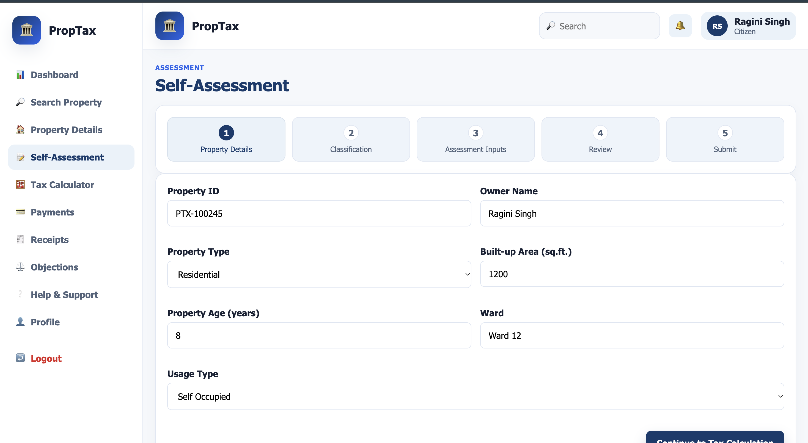
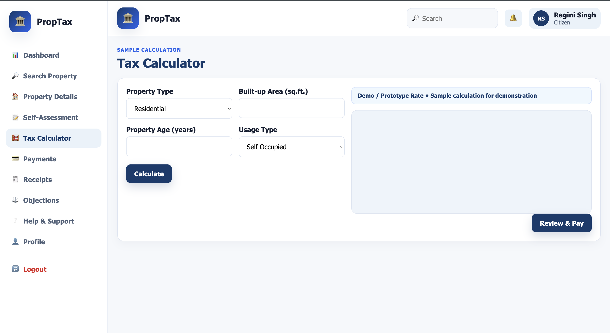
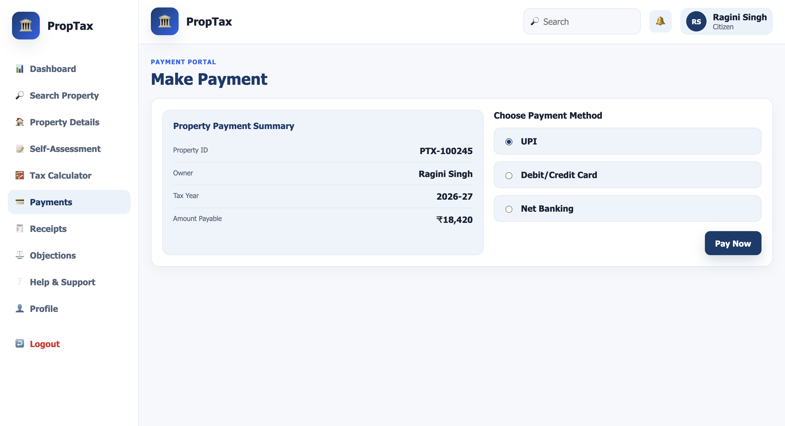
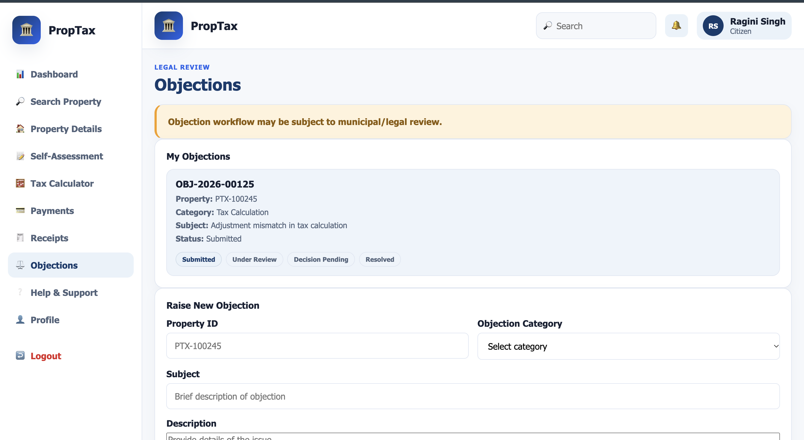
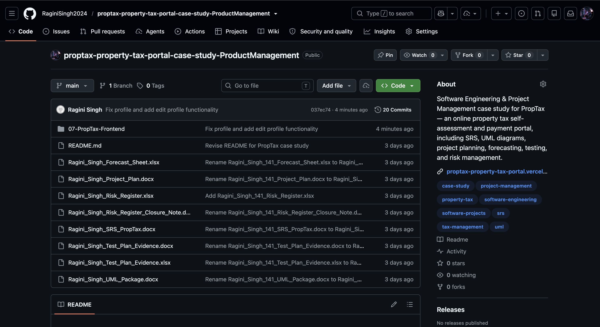

# 🏛️ PropTax – Online Property Tax Self-Assessment & Payment Portal

<p align="center">
  <strong>Software Engineering & Project Management – Case Study No. 141</strong>
</p>

<p align="center">
  <a href="https://proptax-property-tax-portal.vercel.app/">
    
  </a>
  <a href="https://stitch.withgoogle.com/projects/12519224402147468096">
    
  </a>
  <a href="https://docs.google.com/document/d/1g9Kua1PmE7Gc4bYEMrujKy8jndxS2j3po7Oj-PgJ3CA/edit?usp=sharing">
    
  </a>
  <a href="https://github.com/RaginiSingh2024/proptax-property-tax-portal-case-study-ProductManagement">
    
  </a>
</p>

---

## 📌 Project Information

| Detail | Information |
|---|---|
| **Student** | Ragini Singh |
| **Roll Number** | 150096724023 |
| **Program** | B.Tech CSE |
| **Semester** | V |
| **Subject** | Software Engineering & Project Management |
| **Case Study No.** | 141 |
| **Case Study** | PropTax – Online Property Tax Self-Assessment and Payment Portal |
| **Project Type** | Software Engineering & Project Management Case Study |
| **Frontend** | HTML5, CSS3, Vanilla JavaScript |
| **Deployment** | Vercel |
| **Design / Prototype** | Google Stitch |
| **Version Control** | Git & GitHub |

---

# 🏛️ About the Project

**PropTax** is an online property tax self-assessment and payment portal designed to simplify the property tax process for citizens.

The proposed system allows property owners to:

- Search for property information
- View property details
- Perform property tax self-assessment
- Calculate estimated property tax
- Make online payment through a simulated payment flow
- Generate and view payment receipts
- View payment history
- Raise objections through an online workflow
- Manage their citizen profile
- Access help and support information

The project combines **Software Engineering, Project Management, Requirements Engineering, UML, Forecasting, Testing, Risk Management, and Frontend Prototyping** into one complete case study.

---

# 📖 Problem Statement

The city has a population of approximately **9 lakh** and around **1.8 lakh properties**.

Currently, property tax collection is mainly handled through ward offices. Although self-assessment is legally allowed, the existing process is largely paper-based.

Citizens face difficulties in:

- Understanding property tax rate tables
- Performing correct self-assessment
- Calculating their tax amount
- Making payments conveniently
- Obtaining payment receipts
- Raising and tracking objections

The case study proposes an online portal to digitize these activities and improve accessibility and transparency.

The IT cell has also indicated that the objection process involves legal procedures and may require additional time.

---

# 🎯 Objectives

- Provide online property search
- Enable property tax self-assessment
- Provide tax calculation support
- Enable online payment
- Generate digital payment receipts
- Provide payment history
- Support objection submission
- Improve citizen accessibility
- Reduce dependency on ward-office visits
- Provide a structured and user-friendly digital workflow

---

# 👥 Target Users

### 👤 Citizen / Property Owner

Citizens can use the portal to:

1. Login
2. Search for a property
3. View property details
4. Perform self-assessment
5. Calculate tax
6. Make a simulated payment
7. Generate a receipt
8. View payment history
9. Submit an objection
10. Manage their profile

---

# 🔄 Citizen Workflow

```text
Login
   ↓
Dashboard
   ↓
Property Search
   ↓
Property Details
   ↓
Self Assessment
   ↓
Tax Calculator
   ↓
Payment
   ↓
Payment Success
   ↓
Receipt
   ↓
Payment History
```

### Objection Workflow

```text
Property / Tax Issue
        ↓
   Raise Objection
        ↓
   Submit Details
        ↓
   Track Objection
```

---

# ✨ Key Features

## 🔐 Authentication

- Demo citizen login
- User session handling
- LocalStorage-based prototype authentication
- Logout functionality

## 🏠 Dashboard

- Citizen overview
- Property information
- Tax-related actions
- Quick navigation
- Payment-related information

## 🔎 Property Search

- Search property records
- View matching property information
- Open detailed property information

## 🏡 Property Details

Displays property-related information such as:

- Property ID
- Owner information
- Address
- Property type
- Area
- Ward information
- Tax-related details

## 📝 Self-Assessment

Citizens can enter required property information and perform self-assessment through a structured form.

The form includes validation to prevent incomplete or invalid submissions.

## 🧮 Tax Calculator

The portal provides a tax calculation interface where users can enter applicable property information and view the calculated amount.

> **Note:** The case study does not provide official municipal tax rates/formulas. Therefore, the values used in the frontend are for **demo/prototype purposes only** and should not be treated as official tax rates.

## 💳 Payment

The frontend provides a simulated payment workflow.

The payment interface demonstrates:

- Payment details
- Payment confirmation
- Payment success
- Receipt generation

> No real monetary transaction is performed.

## 🧾 Receipt

Users can view their payment receipt after completing the simulated payment process.

Receipt functionality includes:

- Receipt details
- Transaction information
- Payment amount
- Property information
- Print functionality

## 📜 Payment History

Users can view previous payment records stored within the browser prototype.

## ⚠️ Objections

The prototype includes an objection submission workflow where citizens can:

- Select an objection type
- Enter relevant information
- Submit an objection
- View objection status

> The actual legal objection procedure requires further clarification and validation with the concerned authority.

## 👤 Profile

The profile section supports:

- View profile
- Edit profile
- First name
- Last name
- Email
- Mobile number
- Address
- City
- Ward
- Role
- Account status

Profile updates are stored using browser LocalStorage in the prototype.

## 🆘 Help & Support

A dedicated help section provides users with guidance related to:

- Property search
- Self-assessment
- Tax calculation
- Payment
- Receipts
- Objections

---

# 🛠️ Technology Stack

| Technology | Purpose |
|---|---|
| **HTML5** | Page structure |
| **CSS3** | Styling and responsive UI |
| **JavaScript** | Frontend functionality |
| **LocalStorage** | Prototype data persistence |
| **Git** | Version control |
| **GitHub** | Source code repository |
| **Vercel** | Frontend deployment |
| **Google Stitch** | UI design / prototype |

---

# 📂 Repository Structure

```text
proptax-property-tax-portal-case-study-ProductManagement/
│
├── 07-PropTax-Frontend/
│   ├── index.html
│   ├── dashboard.html
│   ├── property-search.html
│   ├── property-details.html
│   ├── self-assessment.html
│   ├── tax-calculator.html
│   ├── payment.html
│   ├── payment-success.html
│   ├── receipt.html
│   ├── payment-history.html
│   ├── objections.html
│   ├── help.html
│   ├── profile.html
│   ├── css/
│   │   └── style.css
│   ├── js/
│   │   ├── app.js
│   │   ├── data.js
│   │   ├── calculator.js
│   │   ├── payment.js
│   │   └── objections.js
│   └── assets/
│
├── Screenshots/
│   ├── homepage.png
│   ├── loginpage.png
│   ├── profile.png
│   ├── property.png
│   ├── search.png
│   ├── Self-Assessment.png
│   ├── tax-calculator.png
│   ├── payment.png
│   ├── Receipt.png
│   ├── objective.png
│   ├── help&support.png
│   └── repo.png
│
├── Ragini_Singh_SRS_PropTax.docx
├── Ragini_Singh_UML_Package.docx
├── Ragini_Singh_Project_Plan.docx
├── Ragini_Singh_Forecast_Sheet.xlsx
├── Ragini_Singh_Test_Plan_Evidence.docx
├── Ragini_Singh_Test_Plan_Evidence.xlsx
├── Ragini_Singh_Risk_Register.xlsx
├── Ragini_Singh_Risk_Register_Closure_Note.docx
├── Ragini_Singh_PropTax_Final_Project_Documentation.pdf
└── README.md
```

---

# 📚 Project Documentation

### 📄 Software Requirements Specification

- Introduction
- Purpose
- Problem statement
- Objectives
- Stakeholders
- System overview
- Scope
- Functional requirements
- Non-functional requirements
- MoSCoW prioritization
- Assumptions
- Requirements Traceability Matrix
- Release scope

### 📐 UML Package

- Use Case Diagram
- Class Diagram
- Sequence Diagram
- Activity Diagram
- State Diagram
- Cohesion and Coupling analysis
- UML consistency notes

### 📅 Project Plan

- Work Breakdown Structure
- Network representation
- Dependency analysis
- Critical dependency path
- Gantt chart
- Sprint planning
- Milestones
- Resource allocation
- Release planning

### 📊 Forecast Sheet

- Given project data
- Backlog calculation
- Velocity calculation
- Sprint forecast
- Release forecast
- Comparison with the 16-week constraint
- Assumptions
- Confidence assessment

### 🧪 Test Plan & Evidence

- Boundary Value Analysis
- Equivalence Class Testing
- Decision Table Testing
- Payment test cases
- Receipt test cases
- Security test cases
- Defect log
- Defect density
- Defect Removal Efficiency
- Requirements Traceability Matrix

### ⚠️ Risk Register

- Risk identification
- Probability
- Impact
- Risk exposure
- Risk priority
- Risk mitigation
- Risk monitoring
- Risk closure
- Lessons learned

---

# 📈 Release Planning & Forecasting

| Module | Story Points |
|---|---:|
| Search & Calculator | 34 |
| Payment & Receipts | 21 |
| Objections Workflow | 29 |
| **Total** | **84** |

**Velocity:** 11 story points / 2-week sprint

**Tax year starts:** 16 weeks

## Release 1 – Without Objections

```text
Search & Calculator = 34 points
Payment & Receipts  = 21 points
--------------------------------
Total               = 55 points

55 / 11 = 5 sprints
5 × 2 weeks = 10 weeks

16 - 10 = 6 weeks buffer
```

## Full Scope Including Objections

```text
Total backlog = 84 points

84 / 11 = 7.64 sprints
Rounded up = 8 sprints

8 × 2 weeks = 16 weeks
```

The full scope therefore uses the complete 16-week period with no schedule buffer.

---

# 🧪 Testing Approach

### Boundary Value Analysis

Used for validating input boundaries where applicable.

### Equivalence Partitioning

Inputs are divided into valid and invalid classes to reduce redundant testing.

### Decision Table Testing

Used for validating combinations of conditions in workflows such as payment and objection handling.

### Functional Testing

Covers:

- Login
- Property search
- Property details
- Self-assessment
- Tax calculation
- Payment
- Receipt
- Payment history
- Objections
- Profile

### Security Testing

Basic prototype-level checks include:

- Unauthorized page access
- Input validation
- Session handling
- Logout behavior

---

# 📊 Testing Metrics

Worked example:

```text
Total Tests = 22
Defects Found = 4
Defects Removed Before Release = 3
```

Defect Density:

```text
4 / 22 ≈ 0.18 defects per test
```

Defect Removal Efficiency:

```text
3 / 4 × 100 = 75%
```

> These values are **worked example metrics** for the case study and do not represent production test execution history.

---

# ⚠️ Risk Management

| Risk | Probability | Impact | Exposure |
|---|---:|---:|---:|
| Legal objection requirements unclear/change | 4 | 5 | 20 |
| Tax rate/rebate rules incorrect or incomplete | 3 | 5 | 15 |
| Payment gateway integration failure | 3 | 5 | 15 |
| Velocity below planned value | 3 | 4 | 12 |
| Property data quality issues | 3 | 4 | 12 |
| Security / unauthorized access | 2 | 5 | 10 |
| Late testing defects | 3 | 3 | 9 |

Major mitigation areas include:

- Clarifying legal requirements before implementing the full objection workflow
- Validating approved tax rules before production use
- Testing payment success/failure scenarios early
- Monitoring sprint velocity
- Protecting property and citizen data
- Performing testing continuously throughout development

---

# 🎨 UI Screenshots

## 🏠 Homepage



## 🔐 Login Page



## 👤 Profile



## 🔎 Property Search



## 🏡 Property Details



## 📝 Self-Assessment



## 🧮 Tax Calculator



## 💳 Payment



## 🧾 Payment Receipt


## ⚠️ Objection Workflow



## 🆘 Help & Support


## 💻 GitHub Repository



---

# 🌐 Project Links

### 🚀 Live Deployment

https://proptax-property-tax-portal.vercel.app/

### 🎨 UI Design / Stitch Prototype

https://stitch.withgoogle.com/projects/12519224402147468096

### 📄 Google Docs

https://docs.google.com/document/d/1g9Kua1PmE7Gc4bYEMrujKy8jndxS2j3po7Oj-PgJ3CA/edit?usp=sharing

### 💻 GitHub Repository

https://github.com/RaginiSingh2024/proptax-property-tax-portal-case-study-ProductManagement

---

# 📌 Project Scope

The project demonstrates the complete software engineering and project management lifecycle for the PropTax case study.

The scope includes:

- Requirement analysis
- SRS preparation
- UML modelling
- Project planning
- Sprint forecasting
- Release planning
- Test planning
- Risk management
- Frontend prototyping
- Deployment
- Documentation

---

# ⚙️ Prototype Limitations

This project is an academic prototype.

- No production backend is implemented.
- No real database is connected.
- Payment functionality is simulated.
- Tax rates used in the frontend are demo/prototype values.
- Official municipal tax calculation rules were not provided in the case study.
- Objection handling requires further legal and procedural clarification.
- LocalStorage is used for prototype-level data persistence.
- The application is not intended for real financial transactions.

---

# 🎓 Learning Outcomes

- Software Requirements Engineering
- Functional and Non-Functional Requirements
- SRS Documentation
- UML Modelling
- Agile Sprint Planning
- Story Point Forecasting
- Velocity-Based Estimation
- Release Planning
- Gantt Chart Creation
- Risk Management
- Software Testing
- Defect Analysis
- Requirements Traceability
- Frontend Prototyping
- Git & GitHub
- Vercel Deployment
- Project Documentation

---

# 📦 Final Submission Includes

```text
✅ SRS Document
✅ UML Package
✅ Project Plan
✅ Forecast Sheet
✅ Test Plan & Evidence
✅ Risk Register
✅ Risk Closure Note
✅ Frontend Prototype
✅ UI Design
✅ Screenshots
✅ Final Project Documentation PDF
✅ GitHub Repository
✅ Live Vercel Deployment
```

---

# 👩‍💻 Author

## Ragini Singh

**B.Tech Computer Science & Engineering**  
**Semester V**  
**Roll No.: 150096724023**

**Subject:** Software Engineering & Project Management  
**Case Study No.:** 141

### Project

**PropTax – Online Property Tax Self-Assessment and Payment Portal**

---

<p align="center">
  <strong>PropTax | Software Engineering & Project Management Case Study</strong>
</p>

<p align="center">
  Built as an academic case study demonstrating requirements engineering, project planning, forecasting, testing, risk management, and frontend prototyping.
</p>
